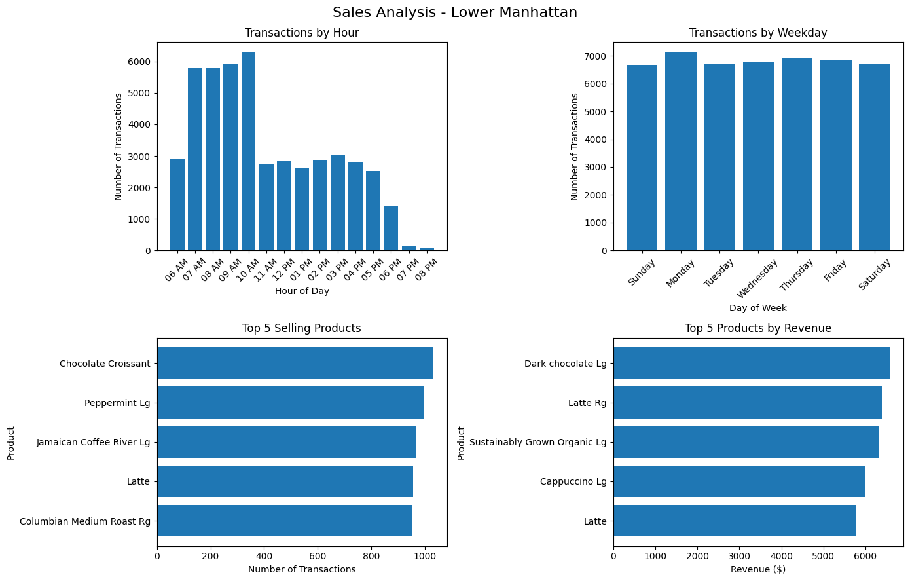

# Coffee Sales Analysis Dashboard

## Tableau Dashboard
View the interactive Tableau dashboard here: 
https://tinyurl.com/4cvw5we8

## Dashboard Preview

## Project Overview
This project analyzes transaction-level coffee shop sales data across three New York City locations. The goal of the analysis was to identify sales patterns, peak business hours, and the most profitable products by both transaction volume and revenue.
The project combines Python for data cleaning and analysis with Tableau for interactive dashboard visualizations.

## Tools Used
- Python
- pandas
- matplotlib
- Tableau
- Git/GitHub
## Key Insights
- Peak transaction hours occur between 8 AM and 10 AM, with the highest activity around 9 AM.
- Sales are relatively consistent across weekdays, suggesting stable customer demand.
- Drinks make up many of the most frequently purchased products across locations.
- The products generating the most revenue are not always the most frequently purchased items.